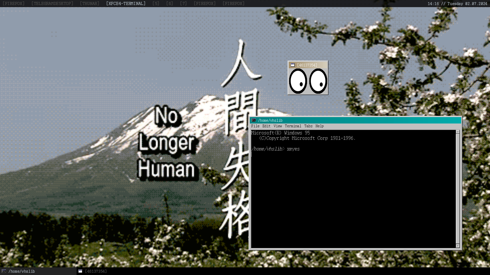

vaporwm - my personal stacking WM in Rust
========================================

Features included:
- 9 workspaces
- tasklist with the ability to reorder windows
- system clock
- move/resize windows
- raise window on click or raise next/prev window
- the topmost window is the active one
- win95 ａｅｓｔｈｅｔｉｃｓ　ヒ挨
- etc

The GIF wallpaper is currently not a part of the WM itself, it's a shell script and honestly it's pretty awkward. Definitely gonna implement this feature as a proper part of vaporwm someday.

TODO explain the keybindings. Those are pretty straightforward though, and you probably can find them out if you've ever had an experience with an Awesome WM setup.

Related
=======

Vaporwm uses "PxPlus ToshibaTxL2 8x16" from [The Ultimate Oldschool PC Font Pack](https://int10h.org/oldschool-pc-fonts) for all text so it's important that you have it on your system.

[Chicago95](https://github.com/grassmunk/Chicago95) GTK & icon themes are highly recommended.
